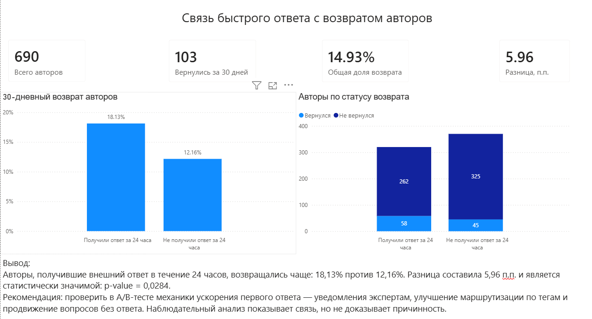

# Анализ возврата авторов Stack Overflow

В этом проекте я проверил, связан ли быстрый ответ на первый наблюдаемый вопрос автора с его возвратом на платформу.

Гипотеза была такой:

> Авторы, которые получили внешний ответ в течение 24 часов, чаще задают новый вопрос в течение следующих 30 дней.

Под внешним ответом я понимаю ответ другого пользователя. Самоответы автора не учитываются.

## Дашборд



Файл Power BI можно открыть здесь:

[stackoverflow_retention_dashboard.pbix](reports/dashboard/stackoverflow_retention_dashboard.pbix)

## Результат

В анализ вошли 690 авторов.

| Группа | Авторов | Вернулись за 30 дней | Доля возврата |
|---|---:|---:|---:|
| Получили внешний ответ за 24 часа | 320 | 58 | 18,13% |
| Не получили внешний ответ за 24 часа | 370 | 45 | 12,16% |

Разница между группами составила **5,96 процентного пункта**.

Для проверки результата я использовал z-тест для сравнения двух долей:

- z-статистика: `2,192`;
- p-value: `0,0284`;
- 95% доверительный интервал разницы: от `0,59` до `11,34` п.п.

При уровне значимости 5% разница статистически значима.

При этом анализ основан на наблюдательных данных. Он показывает связь между быстрым ответом и возвратом автора, но не доказывает, что именно быстрый ответ стал причиной возврата.

## Как проводился анализ

Я взял публичные вопросы, опубликованные с 1 по 7 января 2026 года.

Дальше для каждого автора:

1. Определил первый наблюдаемый вопрос в выбранной когорте.
2. Проверил, получил ли он внешний ответ в течение 24 часов.
3. Нашёл следующий публичный вопрос этого автора.
4. Проверил, был ли он опубликован в течение 30 дней.
5. Сравнил долю возврата между двумя группами.

Первый наблюдаемый вопрос в этом проекте не обязательно является первым вопросом автора за всё время существования аккаунта.

## Что использовалось

- Python
- pandas
- NumPy
- Requests
- PyArrow
- PostgreSQL
- SQL
- psycopg
- statsmodels
- Power BI
- Power Query
- DAX
- Git

## Как устроен проект

```text
Stack Exchange API
        ↓
JSON-файлы
        ↓
обработка в Python
        ↓
Parquet
        ↓
PostgreSQL
        ↓
SQL-витрина
        ↓
статистический тест
        ↓
Power BI
```

## Структура репозитория

```text
stackoverflow-product-analytics/
│
├── reports/
│   └── dashboard/
│       ├── dashboard_screenshot.png
│       └── stackoverflow_retention_dashboard.pbix
│
├── sql/
│   ├── 01_create_schemas.sql
│   ├── 02_create_staging_tables.sql
│   ├── 03_data_quality_checks.sql
│   ├── 04_create_author_retention.sql
│   ├── 05_analyze_retention.sql
│   └── 06_create_bi_views.sql
│
├── src/
│   ├── api_test.py
│   ├── inspect_parquet.py
│   ├── load_answers.py
│   ├── load_questions.py
│   ├── load_to_postgres.py
│   ├── load_user_questions.py
│   ├── prepare_answers.py
│   ├── prepare_questions.py
│   ├── prepare_user_questions.py
│   └── test_retention_difference.py
│
├── .env.example
├── .gitignore
├── requirements.txt
└── README.md
```

Исходные и обработанные данные хранятся в папке `data`, но не загружаются в GitHub, потому что папка добавлена в `.gitignore`.

## Основные файлы

### Загрузка данных

- `load_questions.py` — загрузка вопросов;
- `load_answers.py` — загрузка ответов;
- `load_user_questions.py` — загрузка следующих вопросов авторов.

### Подготовка данных

- `prepare_questions.py` — подготовка вопросов;
- `prepare_answers.py` — подготовка ответов;
- `prepare_user_questions.py` — подготовка истории вопросов авторов;
- `inspect_parquet.py` — проверка Parquet-файлов.

### PostgreSQL и SQL

- `load_to_postgres.py` — загрузка данных в PostgreSQL;
- `01_create_schemas.sql` — создание схем;
- `02_create_staging_tables.sql` — создание staging-таблиц;
- `03_data_quality_checks.sql` — проверки качества данных;
- `04_create_author_retention.sql` — построение таблицы с возвратом авторов;
- `05_analyze_retention.sql` — расчёт итоговых показателей;
- `06_create_bi_views.sql` — представления для Power BI.

### Статистика

- `test_retention_difference.py` — сравнение долей возврата и расчёт статистической значимости.

## Локальный запуск

### 1. Создать виртуальное окружение

```powershell
python -m venv .venv
.venv\Scripts\Activate.ps1
```

### 2. Установить зависимости

```powershell
pip install -r requirements.txt
```

### 3. Создать `.env`

```powershell
Copy-Item .env.example .env
```

После этого нужно заполнить в `.env` параметры подключения к PostgreSQL.

### 4. Загрузить данные

```powershell
python src/load_questions.py
python src/load_answers.py
python src/load_user_questions.py
```

### 5. Подготовить данные

```powershell
python src/prepare_questions.py
python src/prepare_answers.py
python src/prepare_user_questions.py
```

### 6. Подготовить PostgreSQL

Сначала выполнить:

```text
sql/01_create_schemas.sql
sql/02_create_staging_tables.sql
```

Затем загрузить данные:

```powershell
python src/load_to_postgres.py
```

После этого выполнить:

```text
sql/03_data_quality_checks.sql
sql/04_create_author_retention.sql
sql/05_analyze_retention.sql
sql/06_create_bi_views.sql
```

### 7. Запустить статистический тест

```powershell
python src/test_retention_difference.py
```

### 8. Открыть Power BI

```text
reports/dashboard/stackoverflow_retention_dashboard.pbix
```

Для обновления данных в Power BI нужно, чтобы PostgreSQL был запущен.

## Вывод

Авторы, которые получили внешний ответ в течение 24 часов, возвращались чаще:

**18,13% против 12,16%**.

Следующий шаг для проверки причинного эффекта — A/B-тест механик, которые ускоряют получение первого ответа.